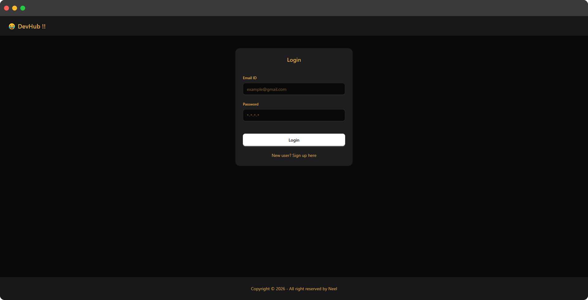
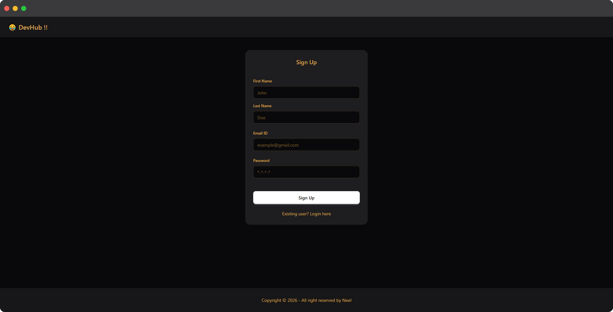
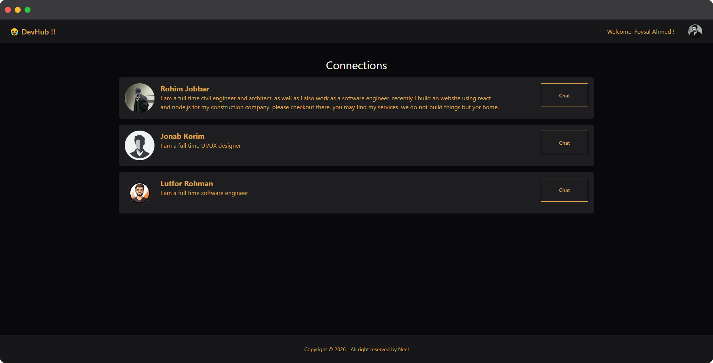
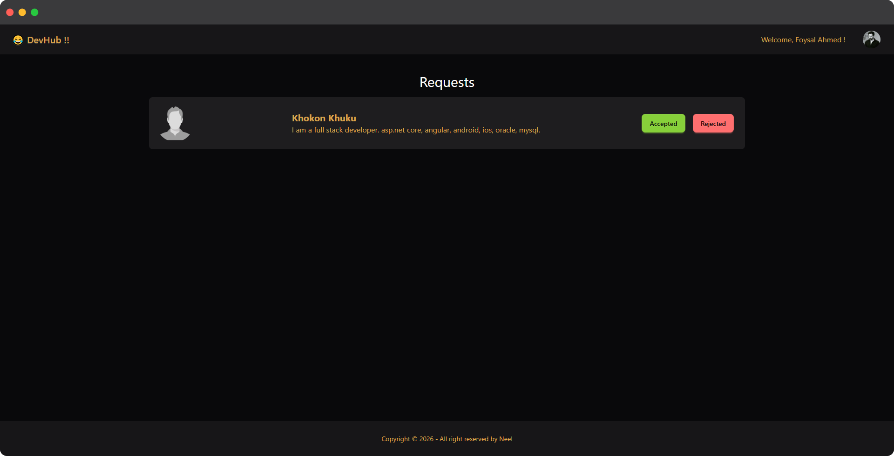
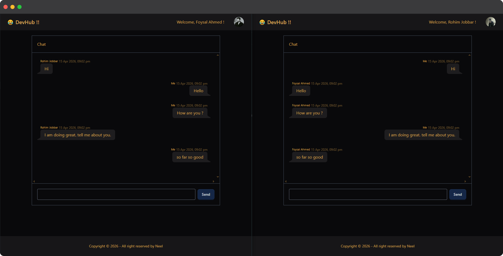

# Node.js-Learning

My personal Node.js learning repository - covering fundamentals to advanced concepts.

## Global object:
- For node, global object is known as "global", just like window in browser.
- logging "this" in node will be empty object.
- based on the community's decision there is one more property called "globalThis" is also the global object, which exist in every js engine.

## Module:
- whenever we create a separate module and import it using require() function, that module run (add console.log() statement to check), but its variables and functions are private to other modules. we cannot access it normally. we need to export properties to use those in other modules.
- we can import properties using object or destructuring. for destructuring, we must maintain the properties same name.
- we can use 2 kind of modules:
    - **CommonJS module (CJS)**: it was the original system for Node.js. for import/export we use require() function and module.exports. it is synchronous(blocking). requires bundling or transpiling (transpiling is the process of converting source code from one version of JavaScript (e.g., modern ES6+) into another version (e.g., older ES5) that can run in environments with limited or outdated support for the newer features). not natively supported. works in non-strict mode
    - **ES module (ESM, MJS)**: it is the modern, standardized system for both browsers and Node.js. we can use import and export keyword. asynchronous (non-blocking). native support in all modern browsers.<br>To use ES module we need to add extension in package.json. works in strict mode.
- When we use require(), Node.js internally wraps the entire module's code in a function before executing it. This wrapper function is essentially an IIFE (Immediately Invoked Function Expression) and provides several key benefits: 
    - Scope Isolation: Variables, functions, and objects declared within a module are scoped locally to that module, preventing them from polluting the global namespace.
    - Parameter Injection: The wrapper function is invoked with specific "global-like" variables as arguments, including exports, require, module, __filename, and __dirname. This is how these variables are made available within our module file.
    - IIFE syntax:
        ```
        (function () {
            console.log("This is an anonymous function");
        })();
        ```
    - The structure of the wrapper is similar to this:
        ```
        (function(exports, require, module, __filename, __dirname) {
            // module code goes here
            const myVar = "some value";
            module.exports = myVar;
        })(module.exports, require, module, __filename, __dirname);

        ```
- ESM use the import, export statements which are modern, standardized approach to modularity in JavaScript.
    - No IIFE Wrapper: ESM does not use an IIFE wrapper function for scope isolation. Instead, the module system is a built-in feature of the JavaScript language and runtime environments (browsers and Node.js).
    - Static Analysis: import statements are static, meaning they are processed at compile time, which enables tools to perform optimizations like "tree-shaking" (removing unused code).
    - Strict Mode by Default: ESM modules run in strict mode automatically.
- require() function perform:
    - resolve the module (check the file type)
    - load the file content
    - compile the code
    - wrap inside the IIFE
    - evaluation (execute the code and return the module.exports)
    - cache the module for reuse in other modules

## Synchronous & Asynchronous
- Synchronous programming executes the tasks in a predetermined order, where each operation waits for the previous one to complete before proceeding.
    - known as bloking or sequential programming.
- Asynchronous programming allows tasks to execute independently of one another, enabling concurrent execution and improved performance.
    - known as non-blocking programming.

## Thread
A thread is the smallest unit of execution within a process in an operating system. It represents a single sequence of instructions that can be managed independently by a scheduler. Multiple threads can exist within a single process, sharing the same memory space but executing independently. This allows for parallel execution of tasks within a program, improving efficiency and responsiveness.<br>Threads can be either:
- signle-threaded
- multi-threaded

js is single-threaded. but with the power of node.js it can handle asynchronous operations, allowing js to perform multiple tasks concurrently.

## V8
V8 is Google’s open source high-performance JavaScript and WebAssembly engine, written in C++. It is used in Chrome and in Node.js, among others. It implements ECMAScript and WebAssembly, and runs on Windows, macOS, and Linux systems that use x64, IA-32, or ARM processors. V8 can be embedded into any C++ application.

**Call stack**: The call stack is a fundamental mechanism used by the JavaScript engine (V8) to keep track of the functions being executed in a program. It operates on a Last-In, First-Out (LIFO) principle.
- The JavaScript engine operates with a single call stack, and all the code we write is executed within this call stack. The engine runs on a single thread, meaning it can only perform one operation at a time.
- In addition to the call stack, the JavaScript engine also includes a memory heap. This memory heap stores all the variables, numbers, and functions that our code uses.
- One key feature of the JavaScript V8 engine is its garbage collector. The garbage collector automatically identifies and removes variables that are no longer in use, freeing up memory.

The V8 engine follows a series of stages to execute JavaScript code, utilizing a **Just-In-Time (JIT)** compilation approach to balance fast startup times with high performance. The primary stages are:
- **Parsing**: The V8 engine first parses the source code into a data structure it can understand.
    - **Tokenization**: The code is broken down into smaller units called tokens (e.g., keywords, operators, variable names).
    - **Abstract Syntax Tree (AST)**: The tokens are used to build an AST, a hierarchical tree-like representation of the code's structure. V8 uses a pre-parser to quickly scan code and identify function boundaries for potentially non-immediate execution, saving initial parsing time.

*before explain the next stage, We need to know that node.js is both interpreted and compiled through a process called Just-In-Time (JIT) compilation. It is not purely interpreted or traditionally compiled ahead-of-time.*

- **Interpretation**: The AST is passed to the interpreter called **Ignition**, which generates and executes bytecode. Bytecode is a compact, low-level representation of the code that is more efficient than the raw source code. During interpretation, V8 collects profiling data (type feedback) to identify "hot" functions, which are functions executed frequently.<br> **Inline Caching (IC)** starts in the Ignition interpreter. As the interpreter runs code, it uses ICs to store "feedback" (e.g., object shapes/hidden classes) about accessed properties in a memory structure. When the same function runs again, V8 skips expensive lookups, using the cached location for property access.
- **Optimization/Compilation**: When the profiler identifies hot code, the **TurboFan** optimizing compiler takes the bytecode and type feedback to generate highly optimized machine code (native code). This machine code is specific to the underlying hardware and executes much faster than the bytecode.<br> **Copy Elision** occurs in the TurboFan optimizing compiler. While translating bytecode to machine code, TurboFan analyzes the usage of temporary objects. If an object is created and then immediately copied, TurboFan "elides" (eliminates) the copy operation to save memory and CPU cycles.
- **Execution**: The machine code is then executed directly by the computer's processor.
- **Deoptimization**: The TurboFan compiler makes assumptions during optimization based on the collected type feedback. If an assumption turns out to be incorrect during execution (e.g., a function suddenly receives a different type of argument than expected), V8 discards the optimized machine code and falls back to the Ignition interpreter to resume execution with the correct type handling.

Throughout this process, simultaneously the **Orinoco garbage collector** runs in separate threads to manage memory automatically, freeing up space no longer needed by the application. Orinoco garbage collector designed to reduce main-thread pauses ("jank") by using parallel, incremental, and concurrent techniques. It divides memory into young and old generations, employing a fast "Scavenger" for new objects and a "Mark-Sweep-Compact" algorithm for the old space to reclaim memory efficiently without stopping execution.

## Synchronous code execution
- Global Execution Context Creation.
- Memory Creation. register variables and functions to the memory. undefined to variables and entire function definition to function.
- code execution. during this step, when engine finds any function, engine creates function execution context and follow same process.
- after complete function execution, call stack pop it and after executing all, call stack finally pop the global execution context.

## libuv
Libuv is a high-performance, open-source C library primarily designed for asynchronous, non-blocking I/O operations. Originally developed for Node.js, it acts as the backbone of its event-driven architecture, enabling efficient handling of network sockets, file systems, DNS resolution, and child processes across different platforms.

## Asynchronous code execution
V8 execute synchonous operations line by line. but when it finds any async task, it passes the task to the libuv. OS level operations like file read, write, input, output, DB operations, network call, socket related task, timer, libuv can perform.<br> V8 engine perform all the sync task and passes async tasks to libuv and libuv complete the tasks and wait for when the call stack become free. once V8 engine complete all the async task and clear memory via garbage collector, pop global context and the call stack become free, libuv returns all the responses to the call stack via event loop.

## Event loop
event loop is a core mechanism that allows Node.js to perform non-blocking I/O operations despite using a single JavaScript thread. It is a continuous process, managed by the underlying libuv library, that orchestrates the execution of synchronous and asynchronous code by managing various queues of callback functions.<br>One Cycle of the event loop is known as **tick**.

event loop traverses several phases in a specific order during each iteration:
- **Timers phase**: This phase processes timers using min-heap, that have been set using setTimeout() and setInterval().
- **Pending callbacks**: This phase executes I/O-related callbacks that were deferred from the previous loop cycle. pending callbacks handle low-level system errors.
- **Idle/Prepare**: This phase in the Node.js event loop is an internal, low-level stage used exclusively by libuv for housekeeping and optimization before entering the Poll phase. It prepares the event loop to check for new I/O events, acting as a setup phase to ensure efficient handling of network connections and file system tasks.
- **Poll**: The Poll phase executes most of the tasks like- I/O, file reading, HTTP requests and much more.
- **Check**: Executes setImmediate() callbacks immediately after the poll phase finishes.
- **Close**: Handles cleanup tasks, such as closing a socket connection.

There are 2 special microtask queues in Node.js:
- nextTick queue managed by Node for process.nextTick callback.
- microtask queue handled by V8 for Promise callback.

They are not part of the event loop phases.

## Thread pool
The thread pool in Node.js is a collection of background worker threads managed by the libuv library that handles time-consuming or blocking operations, allowing the main, single-threaded event loop to remain non-blocking. in node.js, size of the thread pool is 4 by default. thread pool performs operations like:
- File System Operations: All fs module operations, except for fs.FSWatcher.
- DNS(Domain Name System) Lookups: Specifically dns.lookup(), as opposed to dns.resolve(), which uses native async mechanisms.
- Cryptography: Operations like crypto.pbkdf2() and crypto.scrypt().
- Compression: Zlib operations.

when all threads are blocked, operations waits for thread to be free.

There are also some operations handled by:
- OS kernel: Operations like network requests (using the net or http modules). libuv uses Epoll for linux, Kqueue for macOS, IOCP for windows to person such operations. when libuv interacts with the OS for networking tasks, it uses sockets. Networking operations occur through these sockets. Each socket has a socket descriptor, also known as a file descriptor (although this has nothing to do with the file system).<br><br>When an incoming request arrives on a socket, and we want to write data to this connection, it involves blocking operations. To handle this, a thread is created for each request. However, creating a separate thread for each connection is not practical, especially when dealing with thousands of requests.<br><br>Instead, the system uses efficient mechanisms provided by the OS such as epoll (on Linux) or kqueue (on macOS) or IOCP (on Windows). These mechanisms handle multiple file descriptors (sockets) without needing a thread per connection.<br><br>Here’s how it works:
    - epoll (Linux), kqueue (macOS) and IOCP (Windows) are notification mechanisms used to manage many connections efficiently.
    - When we create an epoll or kqueue descriptor, it monitors multiple file descriptors (sockets) for activity.
    - The OS kernel manages these mechanisms and notifies libuv of any changes or activity on the sockets.
    - This approach allows the server to handle a large number of connections efficiently without creating a thread for each one.

  The kernel-level mechanisms, like epoll, kqueue and iocp , provide a scalable way to manage multiple connections, significantly improving performance and resource utilization in a high-concurrency environment.

## Socket
A network socket is an endpoint for sending and receiving data between two programs over a network, defined by the combination of an IP address and a port number. It serves as the interface between an application and the network protocol stack (like TCP/IP), allowing programs to communicate using a unique address.

## File descriptor
file descriptor are integral to Unix-like operating systems, including Linux and macOS. They are used by the operating system to manage open files, sockets, and other I/O resources.

## Socket descriptor
socket descriptors are a special type of file descriptor used to manage network connections. They are essential for network programming, allowing processes to communicate over a network.

## Event Emitters
Event Emitters are a core concept in Node.js, used to handle asynchronous events. They allow objects to emit named events that can be listened to by other parts of the application. The EventEmitter class is provided by the Node.js events module. Here's a brief overview:
- Creating an EventEmitter: we create an instance of EventEmitter and use the on method to register event listeners.
- Emitting Events: Use the emit method to trigger events and pass data to listeners.
- Handling Events: Listeners (functions) handle the emitted events and perform actions based on the event data.

## Streams
Streams in Node.js are objects that facilitate reading from or writing to a data source in a continuous fashion. Streams are particularly useful for handling large amounts of data efficiently.

## Buffers
Buffers are used to handle binary data in Node.js. They provide a way to work with raw memory allocations and are useful for operations involving binary data, such as reading files or network communications.

## Pipes
Pipes in Node.js are a powerful feature for managing the flow of data between streams. They simplify the process of reading from a readable stream and writing to a writable stream, facilitating efficient and seamless data processing.

## WebSocket
A computer communications protocol that provides full-duplex (two-way) communication channels over a single, long-lived TCP connection.

- Unlike HTTP, where the client must ask for data, WebSockets allow the server to send data to the client at any time without being asked. Both can send and receive simultaneously. Every WebSocket starts as an HTTP request. The client sends a special "Upgrade" header. If the server agrees, the connection "switches" from HTTP to the WebSocket protocol. Once the connection is established, it stays open as long as the client or server wants. This eliminates the need to constantly open and close connections (which saves a lot of time and resources). After the initial handshake, the "headers" sent with each message are very small (only a few bytes), compared to HTTP headers which can be several kilobytes. This makes it incredibly fast.
- Unlike SQL or HTTP (which are often stateless), WebSockets are stateful. This means the server knows exactly which user is connected for the entire duration of the session without checking a database every time.
- Just like HTTPS is the secure version of HTTP, WSS (WebSocket Secure) is the encrypted version of WebSockets, protecting data from "man-in-the-middle" attacks. 

## Execution process
- When a Node.js program starts, V8 begins executing all synchronous JavaScript code on the main thread using the call stack.
- Every synchronous statement runs immediately and blocks the thread until it finishes. Nothing else can run while the call stack is busy.
- When asynchronous APIs are called (such as setTimeout, setImmediate, fs.readFile, crypto, or network operations), they are not executed immediately.
- These async APIs are implemented in Node’s C++ core layer. That layer communicates with libuv, which is the library responsible for the event loop, timers, thread pool, and OS-level I/O handling.
- When setTimeout or setInterval is called:
    - Node core registers a timer with libuv.
    - libuv stores the timer internally.
    - The callback will run later in the Timers phase when the delay has expired.
- When fs.readFile or certain crypto operations are called:
    - Node core delegates the work to libuv.
    - libuv sends the task to its internal thread pool.
    - When the thread finishes the task, the callback becomes ready for execution in the Poll phase.
- When network operations (TCP/HTTP) are performed:
    - libuv registers them with the operating system kernel.
    - The OS notifies libuv when data is ready.
    - The callback is then queued for execution in the Poll phase.
- setImmediate is registered by Node core to run later in the Check phase of the event loop.
- Promise callbacks (.then, await) are handled entirely by V8. They are placed into the microtask queue.
- process.nextTick callbacks are stored in a special nextTick queue managed by Node. This queue has higher priority than the Promise microtask queue.
- After the entire synchronous script finishes executing and the call stack becomes empty, Node performs a microtask checkpoint:
    - First, it executes all callbacks in the process.nextTick queue.
    - Then, it executes all callbacks in the Promise microtask queue.
    - Both queues are fully drained before moving forward.
- Once synchronous code and initial microtasks are completed, the event loop begins running.
- The event loop moves through its phases in this order:
    - Timers
    - Pending Callbacks
    - Idle/Prepare (internal, not accessible from JavaScript)
    - Poll
    - Check
    - Close Callbacks
- In the Timers phase, expired setTimeout and setInterval callbacks are executed.
- In the Pending Callbacks phase, certain system-level I/O callbacks that were deferred from the previous cycle are executed.
- The Idle and Prepare phases are used internally by libuv for housekeeping and preparing for the Poll phase. JavaScript code cannot run directly in these phases.
- In the Poll phase:
    - The event loop executes I/O callbacks such as file reads and network responses.
    - If no callbacks are ready, the event loop may wait here for new I/O events.
- In the Check phase, setImmediate callbacks are executed.
- In the Close Callbacks phase, close event handlers such as socket.on('close') are executed.
- Within each phase, the event loop processes one callback at a time.
- A callback (whether timer, I/O, immediate, or close) can only execute when the call stack is empty. JavaScript execution must finish before another callback begins.
- After executing each individual callback, Node performs another microtask checkpoint:
    - It drains the entire process.nextTick queue.
    - Then it drains the entire Promise microtask queue.
    - Only after both queues are empty does the event loop continue.
- This means microtasks do not wait for a full phase to complete. They run after every single callback execution.
- The event loop continues rotating through its phases as long as there are pending timers, I/O operations, or scheduled callbacks.
- If there are no more callbacks to process and no pending async operations, the program exits.

When we write only synchronous code then Node is single threaded and for asynchronous code it is multi-threded.

### Things to follow:
- don't block the main thread.
    - don't use sync methods.
    - don't perform havy json operation.
    - don't perform complex regex operation.
    - don't perform complex calculations or run loop.

## Server
A server is a powerful computer, hardware device, or software program designed to manage network resources, store data, and process requests from other devices known as "clients". Operating within a client-server model, servers provide services like web hosting, data storage, or application management, handling multiple requests simultaneously.
- **Hardware**: A physical machine (computer) that provides resources and services to other computers (clients) over a network.
- **Software**: An application or program that handles requests and delivers data to clients.

## Protocol
A network protocol is a collection of rules that governs how data is transmitted, received, and interpreted between devices on a network, regardless of their internal structure or design.
- Defines what, how, and when data is communicated.
- Enables communication between heterogeneous devices.
- Ensures reliable and standardized data exchange.
- Prevents data loss, duplication, and misinterpretation.

The **OSI (Open Systems Interconnection) Model** is a set of rules that explains how different computer systems communicate over a network. OSI Model was developed by the International Organization for Standardization (ISO). The OSI Model consists of 7 layers and each layer has specific functions and responsibilities. This layered approach makes it easier for different devices and technologies to work together.
layers:
- Physical Layer
- Data Link Layer (DLL)
- Network Layer
- Transport Layer
- Session Layer
- Presentation Layer
- Application Layer


The protocols can be broadly classified into three major categories:
- **Network Communication**: Communication protocols are really important for the functioning of a network. They are so crucial that it is not possible to have computer networks without them. These protocols formally set out the rules and formats through which data is transferred. These protocols handle syntax, semantics, error detection, synchronization, and authentication. Below mentioned are some network communication protocol:
     - **Hypertext Transfer Protocol(HTTP)**: Hypertext Transfer Protocol (HTTP) is an application layer (Layer 7) protocol used for transferring hypertext data between systems on the World Wide Web.
        - Works on a client-server model.
        - Used for loading web pages in browsers.
        - Stateless protocol (does not store session information).
        - Most data exchange on the web uses HTTP.
        - Less secure unless used with HTTPS.
    - **Transmission Control Protocol(TCP)**: Transmission Control Protocol (TCP) is a connection-oriented transport layer protocol that provides reliable and ordered data delivery.
        - Establishes a connection before data transmission.
        - Uses sequenced acknowledgments to ensure reliability.
        - Provides error detection and flow control.
        - Guarantees data delivery in the correct order.
        - Used in email, FTP, web browsing, and streaming services.
    - **User Datagram Protocol(UDP)**: User Datagram Protocol (UDP) is a connectionless transport layer protocol that provides fast but unreliable data transmission.
        - Does not establish a connection before sending data.
        - No error recovery, flow control, or reliability mechanisms.
        - Faster than TCP due to minimal overhead.
        - Suitable where speed is more important than accuracy.
        - Used in video streaming, online gaming, multicasting, and broadcasting.
    - **Border Gateway Protocol(BGP)**: Border Gateway Protocol (BGP) is a routing protocol used to exchange routing information between autonomous systems on the Internet.
        - Controls how data packets travel across multiple networks.
        - Used between large networks operated by different organizations.
        - Connects LANs to other LANs across the Internet.
        - Ensures efficient and scalable Internet routing.
        - Plays a critical role in global Internet connectivity.
    - **Address Resolution Protocol(ARP)**: Address Resolution Protocol (ARP) maps logical IP addresses to physical MAC addresses within a local network.
        - Used in local area networks (LANs).
        - Maintains an ARP cache for IP-to-MAC mappings.
        - Helps devices identify each other on a network.
        - Essential for packet delivery within a LAN.
        - Operates between the Network and Data Link layers.
    - **Internet Protocol(IP)**: Internet Protocol (IP) is a network layer protocol responsible for addressing and routing data packets across networks.
        - Sends data from source host to destination host.
        - Uses IP addresses for device identification.
        - Supports packet routing across different networks.
        - Connectionless and best-effort delivery protocol.
        - Forms the foundation of the Internet.
    - **Dynamic Host Configuration Protocol(DHCP)**: Dynamic Host Configuration Protocol (DHCP) is a network management protocol used to automatically configure devices on IP networks.
        - Automatically assigns IP addresses to devices.
        - Provides configuration details such as subnet mask, gateway, and DNS.
        - Reduces manual network configuration errors.
        - Enables devices to access services like DNS and NTP.
        - Simplifies network administration and management.
- **Network Management**: These protocols assist in describing the procedures and policies that are used in monitoring, maintaining, and managing the computer network. These protocols also help in communicating these requirements across the network to ensure stable communication. Network management protocols can also be used for troubleshooting connections between a host and a client.
    - **Internet Control Message Protocol(ICMP)**: Internet Control Message Protocol (ICMP) is a network layer (Layer 3) protocol used by network devices to send error messages and operational information.
        - Reports network errors and congestion issues.
        - Used for diagnostic purposes such as ping and traceroute.
        - Helps detect unreachable hosts and timeouts.
        - Does not transfer user data directly.
        - Essential for network troubleshooting.
    - **Simple Network Management Protocol(SNMP)**: Simple Network Management Protocol (SNMP) is an application layer (Layer 7) protocol used to manage and monitor network devices on an IP network.
        - Used for network monitoring and management.
        - Consists of three main components: SNMP Manager, SNMP Agent, Managed Device.
        - SNMP agents collect and send network information to the manager.
        - Helps monitor performance, detect faults, and troubleshoot issues.
        - Widely used in enterprise networks.
    - **Gopher**: Gopher is a file retrieval protocol used to search, retrieve, and manage files stored on remote systems.
        - Organizes files in a hierarchical (menu-based) structure.
        - Provides descriptive information for easy file retrieval.
        - One of the earliest Internet protocols.
        - Largely obsolete and replaced by HTTP and FTP.
    - **File Transfer Protocol(FTP)**: File Transfer Protocol (FTP) is a client-server protocol used to transfer files between a local system and a remote host.
    Allows uploading and downloading of files.
        - Operates over TCP/IP.
        - Commonly used for file sharing and website management.
        - Supports authentication using username and password.
        - Less secure unless used with encryption.
    - **Post Office Protocol(POP3)**: Post Office Protocol version 3 (POP3) is an email protocol used by mail clients to retrieve emails from a mail server.
        - Downloads emails from the server to the local device.
        - Emails are usually deleted from the server after download.
        - Uses TCP/IP for communication.
        - Suitable for single-device email access.
        - Simple but less flexible than IMAP.
    - **Telnet**: Telnet is a remote access protocol that allows users to connect to and control a remote system.
        - Enables remote command execution.
        - Operates in a client-server model.
        - Transmits data in plain text (not secure).
        - Mostly replaced by SSH due to security concerns.
        - Used mainly for testing and legacy systems.
- **Network Security**: These protocols secure the data in passage over a network. These protocols also determine how the network secures data from any unauthorized attempts to extract or review data. These protocols make sure that no unauthorized devices, users, or services can access the network data. Primarily, these protocols depend on encryption to secure data.
    - **Secure Socket Layer(SSL)**: Secure Socket Layer (SSL) is a network security protocol used to protect sensitive data and secure communication over the Internet.
        - Encrypts data transferred between communicating systems.
        - Supports both client-to-server and server-to-server communication.
        - Prevents unauthorized access and data interception.
        - Ensures confidentiality of sensitive information.
        - Forms the foundation for secure web communication.
    - **Hypertext Transfer Protocol(HTTPS)**: Hypertext Transfer Protocol Secure (HTTPS) is the secure version of HTTP that ensures encrypted communication between a web browser and a web server.
        - Uses SSL/TLS to secure data transmission.
        - Protects user data from interception and tampering.
        - Commonly used for secure web browsing.
        - Ensures data confidentiality and integrity.
        - Indicated by a padlock icon in web browsers.
    - **Transport Layer Security(TLS)**: Transport Layer Security (TLS) is a security protocol designed to provide privacy, data integrity, and authentication over the Internet.
        - Encrypts data during transmission.
        - Verifies data integrity to detect tampering.
        - Authenticates communicating parties.
        - Widely used in web applications, email services, and VoIP.
        - Successor and more secure version of SSL.
- **Some Other Protocols**
    - **Internet Message Access Protocol (IMAP)**: Internet Message Access Protocol (IMAP) is an email protocol used to retrieve and manage emails directly from a mail server.
        - Allows users to view and manage emails without downloading them permanently.
        - Emails remain stored on the mail server.
        - Enables access to the same mailbox from multiple devices.
        - Supports folder organization and synchronization.
        - More flexible than POP3.
    - **Session Initiation Protocol (SIP)**: Session Initiation Protocol (SIP) is a signaling protocol used to initiate, manage, and terminate real-time communication sessions.
        - Used in voice, video, and messaging applications.
        - Establishes communication sessions between users.
        - Manages session setup, modification, and termination.
        - Commonly used in VoIP and video conferencing.
        - Works with RTP to transmit media data.
    - **Real-Time Transport Protocol (RTP)**: Real-Time Transport Protocol (RTP) is used to transmit audio and video data over IP networks in real time.
        - Supports real-time multimedia communication.
        - Used along with SIP for audio and video transmission.
        - Provides sequence numbering and timestamping.
        - Ensures timely delivery of streaming media.
        - Widely used in video calls and live streaming.
    - **Point To Point Tunnelling Protocol (PPTP)**: Point-to-Point Tunneling Protocol (PPTP) is a protocol used to implement Virtual Private Networks (VPNs).
        - Encapsulates PPP frames inside IP datagrams.
        - Enables secure data transmission over public networks.
        - Used for remote access VPN connections.
        - Simple to configure but less secure than modern VPN protocols.
    - **Trivial File Transfer Protocol (TFTP)**: Trivial File Transfer Protocol (TFTP) is a lightweight and simplified version of FTP used for basic file transfer.
        - Uses UDP instead of TCP.
        - Provides minimal functionality and no authentication.
        - Commonly used for boot files and firmware updates.
        - Faster but less secure than FTP.
    - **Resource Location Protocol (RLP)**: Resource Location Protocol (RLP) is used to locate and assign network resources to users.
        - Helps locate resources such as printers, servers, and devices.
        - Uses broadcast queries to find available resources.
        - Supports efficient resource discovery on a network.
        - Useful in distributed network environments.

**Note**: *OSI (Open Systems Interconnection) Model, its layers, protocol are more related to networking. if anyone finds interest in these topics, can study more about these.*

## Domain
A domain name is a human-friendly address used to locate websites on the internet (e.g., google.com), replacing complex numerical IP addresses. It consists of a top-level domain (like .com) and a unique name, allowing users to easily access, remember, and find specific web servers.

## Domain Name System (DNS)
The Domain Name System (DNS) is the "phonebook of the internet,", a hierarchical and distributed naming system, translating human-friendly domain names (e.g., example.com) into machine-readable IP addresses (192.0.2.1). It enables users to access websites using memorable names instead of complex numerical strings, allowing computers to locate each other instantly across the network.

## Communication process
When we create an HTTP server using Node.js, we are essentially creating an application that listens for requests from clients and responds to them. A client can be a web browser, a mobile application, a frontend application, or any program capable of making network requests.<br>When a client wants to communicate with the server, it establishes a socket connection. A socket represents one endpoint of a network communication channel between the client and the server. This connection usually uses the TCP/IP protocol, which is the standard communication protocol used on the internet.<br>Before a client can connect to a server, it must know the server’s IP address. However, humans typically access websites using domain names such as example.com rather than numeric IP addresses. To resolve this, the client performs a DNS lookup.<br>A DNS (Domain Name System) server maintains mappings between domain names and IP addresses. When a user enters a domain in the browser, the browser queries a DNS server to translate that domain name into the corresponding IP address of the server.<br>Once the IP address is obtained, the client initiates a TCP connection to the server using that IP address and a specific port number (for example, port 80 for HTTP or port 443 for HTTPS). This connection forms a socket between the client and the server.<br>After the connection is established, the client sends an HTTP request through the socket. The server receives the request, processes it, and sends back an HTTP response.<br>During transmission, data is not sent all at once. Instead, it is broken into smaller pieces called packets. The TCP protocol ensures that these packets are delivered reliably, in the correct order, and without loss. If packets arrive out of order, TCP reassembles them correctly before delivering the data to the application.<br>At the application level, Node.js handles incoming data as streams and buffers. Data arriving from the network is processed as a stream, and buffers are used to temporarily store binary data during transmission.<br>After the response is fully sent, the connection may be closed. In some cases (such as HTTP keep-alive), the connection can remain open and be reused for additional requests. Otherwise, if the client needs to make another request later, a new socket connection is created and the process repeats.

## Database & DBMS
A database is an organized collection of structured information, or data, typically stored electronically in a computer system and A Database Management System (DBMS) is software that manages, stores, retrieves, and updates data in a structured format.

## Types of databases
- **Relational**: Relational databases like MySQL and PostgreSQL use structured tables with predefined schemas, making them ideal for handling complex queries and transactions. They ensure data integrity through ACID properties and are widely used for applications requiring robust, relational data models.
- **NoSQL DB**: MongoDB is a NoSQL database that stores data in flexible, JSON-like documents, allowing for dynamic schemas. It's highly scalable and ideal for handling large volumes of unstructured or semi-structured data, making it popular for modern web applications.
- **In-memory DB**: Redis is an in-memory database known for its high-speed data processing capabilities. It supports various data structures like strings, hashes, and lists, making it suitable for caching, real-time analytics, and message brokering.
- **Distributed SQL DB**: CockroachDB is a distributed SQL database designed to scale horizontally across multiple nodes while providing strong consistency and ACID transactions. It's ideal for applications requiring high availability and resilience across different geographic locations.
- **Time Series DB**: InfluxDB is a time series database optimized for handling high write and query loads, particularly for time-stamped data. It's commonly used for monitoring, real-time analytics, and IoT applications where time-based data is crucial.
- **OO DB**: db4o is an object-oriented database that stores data as objects, closely aligning with object-oriented programming languages. It simplifies development by allowing direct storage and retrieval of objects without the need for conversion to relational tables.
- **Graph DB**: Neo4j is a graph database that excels at handling complex relationships between data entities. It uses a graph structure with nodes, relationships, and properties, making it ideal for applications like social networks, recommendation engines, and fraud detection.
- **Hierarchical DB**: IBM IMS is a hierarchical database that organizes data in a tree-like structure with parent-child relationships. It's used primarily in legacy systems for highperformance transaction processing and is known for its reliability in handling large-scale, mission-critical applications.
- **Network DB**: IDMS (Integrated Database Management System) is a network database that represents data using a graph of record types and set relationships. It allows more complex relationships than hierarchical databases and is often used in legacy systems requiring high performance.
- **Cloud DB**: Amazon RDS (Relational Database Service) is a managed cloud database service that supports multiple relational database engines, including MySQL, PostgreSQL, and Oracle. It automates tasks like backups, patching, and scaling, making it easy to deploy and manage databases in the cloud.

**Note**: *There are several types of DB. But most of the time we use relational DB like MySQL, oracol or PostgreSQL as well as NoSQL like mongoDB.*

## SQL VS NoSQL

### SQL:
- **RDBMS (Relational Database Management System)**: The foundational architecture where data is organized into predefined logical relationships. It is the "traditional" way of storing data.
- **Table**: The primary unit of storage. It uses Columns (to define the data type, like "Integer" or "Text") and Rows (to represent an individual entry or record).
- **Rigid Schema**: This is a strict blueprint. You must define your tables and columns before you can insert data. If you want to add a new category later, you must alter the entire database structure.
- **Primary & Foreign Keys**: These are the "links" between tables. A Primary Key uniquely identifies a row, while a Foreign Key connects that row to data in a different table, ensuring "Relational" integrity.
- **ACID Compliance**: This stands for Atomicity, Consistency, Isolation, and Durability. It is a set of properties that guarantee database transactions are processed reliably—essentially ensuring that your data never gets corrupted or lost during a crash.
- **Vertical Scaling**: To handle more traffic, you typically "scale up" by adding more power (CPU, RAM, SSD) to the single server hosting the database.
- **Complex Joins**: SQL is designed to handle complex queries that pull and combine data from many different tables simultaneously using the JOIN command.
- **Use Cases**: Best for structured data where consistency is non-negotiable, such as banking systems, accounting, healthcare records, and legacy ERP systems.

### NoSQL:

- **Non-Relational/Distributed**: A system designed to handle unstructured data that is spread across many different servers. It is built for speed and massive scale.
- **Document**: The most common NoSQL format (usually JSON). Instead of rows and columns, data is stored in "documents" that contain all the information for a record in one place.
- **Dynamic Schema**: Also called "Schema-less." You do not need to define a structure upfront. One document can have 5 fields, and the next can have 10. This allows for very fast development and changes.
- **Horizontal Scaling**: Also known as Sharding. Instead of making one server bigger, you "scale out" by adding hundreds or thousands of smaller, cheaper servers to a cluster to share the load.
- **CAP Theorem**: NoSQL databases balance Consistency, Availability, and Partition Tolerance. Most NoSQL systems prioritize "Availability" (the system is always up) over "Immediate Consistency" (data might take a few seconds to sync across all servers).
- **Data Models**: NoSQL isn't just documents; it includes Key-Value stores (fast caching), Wide-Column stores (massive data sets), and Graph databases (mapping social networks).
- **High Performance**: Because data is often stored together in a single document rather than split across tables, the database can retrieve information much faster for specific types of requests.
- **Use Cases**: Ideal for Big Data analytics, real-time social media feeds, content management (CMS), IoT sensor data, and mobile apps where the data structure changes daily.

## HTTP requests
An HTTP request is a digital message sent from a client (like a web browser or API tool) to a server to initiate an action, such as fetching a webpage, posting data, or deleting a resource.

- **GET**: Retrieves data from the server and returns status 200 on success.
- **POST**: Sends data to create a resource and returns status 201 on success.
- **PUT**: Replaces the entire resource or creates it if not present.
- **PATCH**: Updates only specific parts of a resource.
- **DELETE**: Removes data from the server at a specified location.

## package.json
In Node.js, package.json is a manifest file located at the root of a project that serves as its central configuration hub. It describes the project's metadata, manages its dependencies, and defines automated scripts.

## Cross-Origin Resource Sharing (CORS)
it is a browser-level security feature that allows a web application on one domain to safely access resources (like APIs) on a different domain.<br><br>When you make a cross-origin request (like using ```fetch()``` in JavaScript to call an API on a different domain), the browser automatically adds an Origin header to the request. The server checks that origin. If it's allowed, the server responds with a special header: ```Access-Control-Allow-Origin```. If this header matches your site, the browser lets the data through. If the server doesn't send that header, or the header doesn't match your site, the browser blocks the response.

**Note**: *The request usually actually hits the server; it's the browser that prevents your code from seeing the result.*

For "dangerous" requests (like DELETE, PUT, or those with custom headers), the browser doesn't want to risk sending the data immediately. The browser first sends a "hidden" request using the OPTIONS method. It’s basically asking the server if the request is acceptable or not. If the server responds with a "Yes" (using headers like ```Access-Control-Allow-Methods```), only then does the browser send the actual request.

- ```Access-Control-Allow-Origin``` specifies which domains can access the resource.
- ```Access-Control-Allow-Methods``` Tells the browser which HTTP methods (GET, POST, DELETE, etc.) are permitted.
- ```Access-Control-Allow-Headers``` Tells the browser which custom headers (like Authorization or X-Custom-Header) are allowed.
- ```Access-Control-Allow-Credentials``` Required if you want to send cookies or authentication headers along with the cross-origin request.


## **Note**: *I have tried to add as many details as possible. If you find any topic interesting but need more details, please feel free to read from other resources. If you think any information is incorrect, please let me know (email at below).*


## Practice project
I have designed a backend project uisng node.js-express.js as well as frontend project using react.js. For database I have used Mongodb. pay a visit:
- [Backend](./project/dev_hub_backend/)
- [Frontend](./project/dev_hub_frontend/)

## Project Overview:

<!-- <p align="center">
 
 
 </p> -->
<table border="0">
  <tr>
    <td width="45%">
      
    </td>
    <td width="10%"></td> <!-- This creates the "space between" -->
    <td width="45%">
      
    </td>
  </tr>
</table>
- only registered user can use the app.

<br><br>

- user can see other users in feed and can show interest for connection or ignore profile.

<br><br>

- user can check own profile.

<br><br>
<table border="0">
  <tr>
    <td width="30%">
      
    </td>
    <td width="3%"></td>
    <td width="30%">
      
    </td>
    <td width="3%"></td>
    <td width="30%">
      
    </td>
  </tr>
</table>
- user can check connection list, connection request as well as can chat with connected user.<br><br>

If you find this repository useful, consider giving it a star.

For feedbacks or suggestions:
Email: taufiqneloy.swe@gmail.com